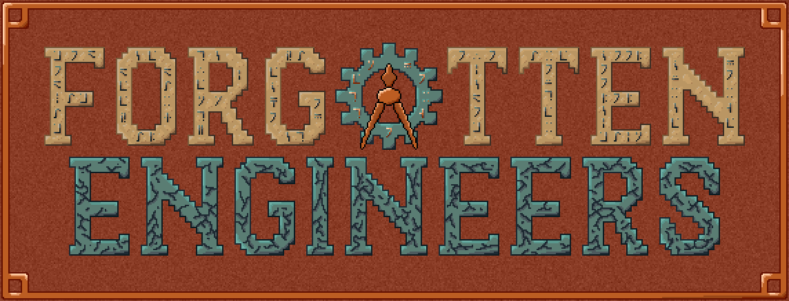

# [Forgotten Engineers](https://curseforge.com/minecraft/mc-mods/forgotten-engineers)

Is a *Minecraft* mod that allows you to rediscover forgotten engineering to automate your inventory and extend your adventures.

Developed for [*CurseForge's* ModJam 2026](https://mod.curseforge.com/minecraft/modjam2026/) 'Echoes of the Past'

-----------------

To see more of [CoolSimulations](https://github.com/coolsimulations) projects, check out the following:
 * [Infinity Water Bucket](https://www.curseforge.com/minecraft/mc-mods/infinity-water-bucket)
 * [Concrete Conversion](https://curseforge.com/minecraft/mc-mods/concrete-conversion)
 * [FloatingItems](https://curseforge.com/minecraft/mc-mods/floatingitems)